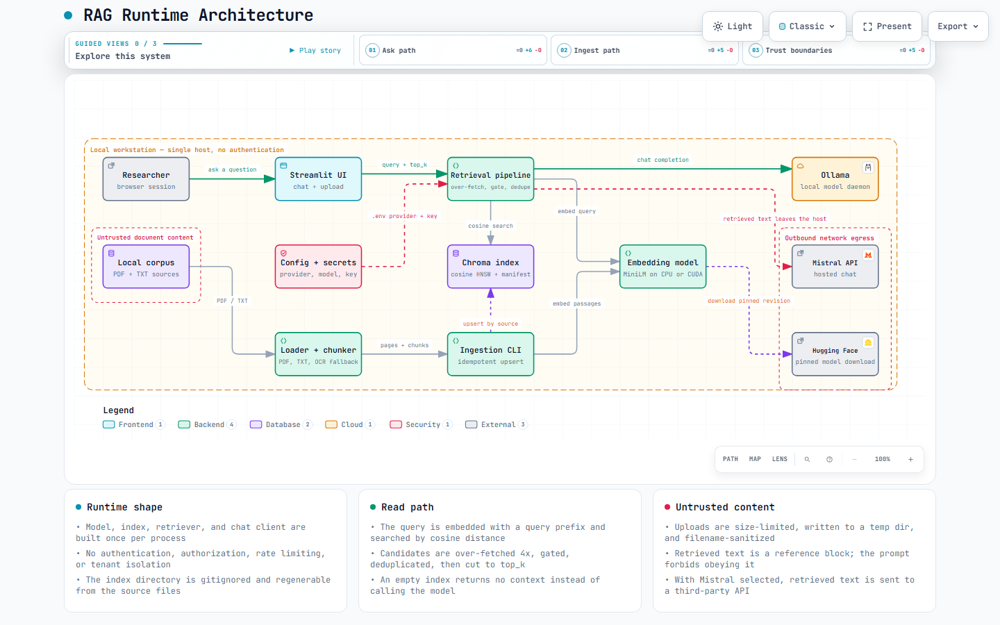

# AI-Powered Conversational RAG System

A conversational retrieval-augmented generation (RAG) application built with
Streamlit, LangChain, ChromaDB, Sentence Transformers, and Mistral AI. It
supports PDF and TXT ingestion, OCR fallback for scanned PDFs, persistent
vector search, source filtering, bounded conversation history, and document
management.

## Features

- Upload a PDF or TXT file from the Streamlit sidebar.
- Bulk-ingest files from `data/pdf/` and `data/textfiles/`.
- Use an explicit cosine Chroma index and normalized embeddings.
- Upsert deterministic chunk IDs so retries do not create duplicate rows.
- Use stable, path/name-scoped source IDs to distinguish files with the same name.
- OCR only pages that have no extractable text layer.
- Retrieve more candidates than requested, apply the score threshold, drop
  duplicate chunk content, and then return at most the requested number of
  distinct chunks.
- Filter searches by source and remove sources without scanning the entire
  collection.
- Keep a bounded chat history and show retrieved context when requested.
- Validate uploads, clean temporary files, and avoid rendering user filenames
  as raw HTML.
- Run unit tests and Ruff checks in CI or locally.

## Architecture

[](https://santoshsingh1707.github.io/RAG-Learning/rag-runtime-architecture.html)

**[Open the interactive architecture diagram →](https://santoshsingh1707.github.io/RAG-Learning/rag-runtime-architecture.html)**

The interactive version has guided views for the ask path, the ingest path, and
the trust boundaries, plus light and dark themes. GitHub strips embedded HTML
and scripts from READMEs, so the diagram is served from GitHub Pages instead;
the image above is a static capture of the same page.

The diagram source is [`docs/rag-runtime-architecture.architecture.json`](docs/rag-runtime-architecture.architecture.json).
Edit that file and re-render rather than editing the HTML, which is generated.

## Requirements

- Python 3.11–3.13
- [uv](https://docs.astral.sh/uv/) (recommended)
- A Mistral API key
- Enough disk space for the embedding model and local Chroma index
- Optional CUDA GPU support; CPU execution is supported

## Installation

1. Clone the repository:

   ```bash
   git clone https://github.com/SantoshSingh1707/RAG-Learning.git
   cd RAG-Learning
   ```

2. Create local environment configuration:

   ```bash
   cp .env.example .env
   ```

   Set at least `RAG_LLM_PROVIDER` in `.env`. Use `ollama` for a fully local
   setup with no credentials, or `mistral` and add `MISTRAL_API_KEY`. `.env` is
   ignored by Git. Do not commit API keys or upload them to an issue or pull
   request.

3. Create the locked environment and install development tools:

   ```bash
   uv sync --extra dev
   ```

   `uv.lock` is checked in and should be updated whenever dependencies change:

   ```bash
   uv lock
   uv sync --extra dev
   ```

   `pyproject.toml` is the only place dependencies are declared. A previous
   `requirements.txt` was removed because it silently drifted out of sync with
   the uv lockfile, which is exactly the failure a duplicate manifest invites.

## Configuration

The application resolves paths relative to the repository, not the shell's
current directory. Defaults can be overridden with environment variables in
`.env`:

| Variable | Default | Purpose |
|---|---|---|
| `MISTRAL_API_KEY` | — | Required only when the provider is `mistral` |
| `MISTRAL_MODEL` | `mistral-small-2506` | Mistral model name |
| `MISTRAL_TIMEOUT_SECONDS` | `45` | LLM request timeout |
| `MISTRAL_MAX_RETRIES` | `2` | Provider retry count |
| `RAG_LLM_PROVIDER` | `mistral` | `ollama` for a local model, `mistral` for the hosted API |
| `OLLAMA_BASE_URL` | `http://localhost:11434` | Ollama daemon address |
| `OLLAMA_MODEL` | `qwen2.5-coder:latest` | Local model tag |
| `OLLAMA_NUM_CTX` | `4096` | Context window in tokens |
| `OLLAMA_NUM_PREDICT` | `512` | Maximum reply length in tokens |
| `OLLAMA_KEEP_ALIVE` | `30m` | How long Ollama keeps the model resident |
| `RAG_MAX_CONTEXT_CHARS` | provider-dependent | Retrieved-text budget sent to the model |
| `HUGGINGFACEHUB_API_TOKEN` | — | Optional private/gated model access |
| `EMBEDDING_MODEL` | `multi-qa-MiniLM-L6-cos-v1` | Embedding model |
| `EMBEDDING_MODEL_REVISION` | pinned commit in `src/config.py` | Reproducible model revision |
| `RAG_COLLECTION_NAME` | `rag_documents_v2` | Cosine Chroma collection |
| `RAG_CHUNK_SIZE` | `1000` | Characters per chunk |
| `RAG_CHUNK_OVERLAP` | `200` | Overlap between chunks |
| `RAG_TOP_K` | `5` | Default retrieval count |
| `RAG_MIN_SCORE` | `0.35` | Minimum cosine similarity |
| `RAG_MAX_HISTORY_MESSAGES` | `8` | Recent turns sent to the LLM |
| `RAG_MAX_UPLOAD_BYTES` | `209715200` | Upload size limit |

If a private Hugging Face model is used, set the token before starting the
application. The default model revision is pinned in `src/config.py`; override
it deliberately when testing a different revision.

`404 Not Found` responses for optional files such as `adapter_config.json`,
`preprocessor_config.json`, and `additional_chat_templates` are expected for
this sentence-transformers repository. They are not errors, and the embedding
model still loads.

The `load_rag_components` function is cached with `st.cache_resource`, so
changes to `.env` only take effect after the Streamlit server is restarted.

## Chat providers

Answer generation runs through either a local Ollama model or the hosted Mistral
API. Set `RAG_LLM_PROVIDER` in `.env` to choose; retrieval, ingestion, and the
vector store are identical in both cases.

### Local (Ollama, no API key)

```bash
ollama serve
ollama pull qwen2.5-coder:latest
```

```ini
RAG_LLM_PROVIDER=ollama
OLLAMA_MODEL=qwen2.5-coder:latest
```

`OLLAMA_KEEP_ALIVE=30m` keeps the model resident, which removes the roughly 40 s
cold start that otherwise repeats on the first question of every session.

**Memory budget.** The embedding model and the chat model share the GPU, so the
context window is the part that runs out first. A 6 GB card with a 7B Q4 model
alongside MiniLM exhausts VRAM above about 4k tokens and the Ollama server
terminates with a CUDA initialisation error. `OLLAMA_NUM_CTX=4096` is the safe
default. On a larger GPU, raise it along with `RAG_MAX_CONTEXT_CHARS`, otherwise
the context is silently truncated to fit the budget. If you hit that error, lower
`OLLAMA_NUM_CTX` first, or run the chat model on CPU while the embeddings stay on
the GPU.

A general model answers prose questions better than a code-specialised one. If
you want broader document Q&A, `ollama pull llama3.1:8b` and point
`OLLAMA_MODEL` at it.

### Hosted (Mistral)

```ini
RAG_LLM_PROVIDER=mistral
MISTRAL_API_KEY=your_key_here
```

Retrieval and answer generation both require network access in this mode.

## Running the application

```bash
uv run streamlit run app.py
```

The first launch downloads the embedding model and initializes the local
Chroma collection. The application exposes document management and chat in
the sidebar and main panel. It is intended for a trusted/local deployment;
there is currently no user authentication or multi-tenant isolation.

## Ingesting local documents

The loader reads files recursively and uses relative paths as stable source
identities. Run a clean rebuild when migrating from the old index or when
removed source files should be purged:

```bash
uv run python ingest_data.py --rebuild
```

For an idempotent update of the sources currently present on disk:

```bash
uv run python ingest_data.py
```

Useful options:

```text
--pdf-directory PATH
--text-directory PATH
--collection-name NAME
--persist-directory PATH
--batch-size N
--rebuild
```

The default collection is `rag_documents_v2`, configured with cosine distance.
The historical `pdf_documents` collection used Chroma's L2 default and is not
silently modified. Re-ingest source files into the v2 collection, verify the
results, and only then remove the old collection manually if it is no longer
needed.

If the existing embeddings were produced by the configured embedding model,
the one-time migration utility can copy and deduplicate them without rerunning
the model:

```bash
uv run python migrate_legacy_index.py --replace-target
```

The migration is non-destructive to the legacy collection. It is still wise to
back up `data/vector_store/` and validate a small query before removing the old
collection.

## How retrieval works

1. PDFs are loaded with `PyPDFLoader`; pages without a text layer are rendered
   with EasyOCR through PyMuPDF.
2. TXT files are loaded with encoding detection.
3. Repeated pages are dropped at load time. Some PDFs emit the same text layer
   twice, which would otherwise be chunked into two different passages with
   different byte offsets. The first occurrence wins so page numbers, and
   therefore citations, stay stable.
4. Recursive character splitting preserves source metadata and adds a stable
   `start_index` to every chunk. Chunks whose normalized content is identical
   to one already produced are dropped, because large text files often repeat
   boilerplate blocks verbatim and identical chunks compete for the same
   evidence slots without adding information.
5. Passage and query embeddings use the appropriate prefixes and are
   normalized. The Chroma HNSW index explicitly uses cosine distance.
6. A cosine distance is converted to similarity with
   `similarity = max(0, min(1, 1 - distance))`.
7. Retrieval over-fetches candidates, applies the threshold, removes duplicate
   chunk content, and only then limits the result to `top_k`. This is a safety
   net for indexes built before the load-time guard existed, not the primary
   defense.
8. The LLM receives the retrieved text as an explicitly untrusted context
   block. It is instructed not to follow instructions found inside documents.

Duplicate detection compares a normalized content digest, so differences in
whitespace, case, or punctuation do not hide a repeat. The check is exact
after normalization rather than semantic: two paraphrases of the same idea are
still treated as distinct evidence.

One consequence is worth knowing. Bulk ingestion deduplicates across the whole
batch, so if two different files contain a byte-identical passage only the
first is indexed and the citation points at that file. A single upload is
deduplicated within that file alone. If your corpus relies on identical text
appearing under two source names as distinct evidence, ingest those files in
separate runs instead.

The source manifest (`data/vector_store/source_manifest.json`) makes source
listing lightweight. It is rebuilt automatically if it is missing, corrupt, or
out of sync with the collection count. The directory is ignored by Git and can
be safely regenerated from the source files.

## Project layout

```text
RAG-Learning/
├── app.py                       # Streamlit UI
├── ingest_data.py               # Idempotent bulk-ingestion CLI
├── migrate_legacy_index.py      # Non-destructive L2-to-cosine migration
├── pyproject.toml               # Dependencies and tool configuration
├── uv.lock                      # Reproducible dependency resolution
├── .env.example                 # Safe configuration template
├── src/
│   ├── config.py                # Paths and runtime settings
│   ├── data_loader.py           # PDF/TXT/OCR loading and splitting
│   ├── embedding.py             # SentenceTransformer lifecycle
│   ├── vector_store.py          # Chroma index and source manifest
│   └── search.py                # Retrieval and RAG prompts
├── tests/                       # Unit tests
└── data/
    ├── pdf/                     # Local PDF input (ignored)
    ├── textfiles/               # Local TXT input (ignored)
    └── vector_store/            # Local Chroma data (ignored)
```

The tracked notebook is experimental. Install its optional dependencies with
`uv sync --extra notebook` if you need to run it.

## Development checks

```bash
uv run pytest -q
uv run ruff check .
uv run ruff format --check .
```

`pytest` tests deterministic IDs, source identity, manifest persistence,
cosine scoring, over-fetching, thresholding, and prompt history without making
network calls.

## Troubleshooting

### Ollama fails with a CUDA initialisation error

`llama-server process has terminated ... shared object initialization failed`
means the chat model and the embedding model together exceeded GPU memory. Lower
`OLLAMA_NUM_CTX` to `2048` and retry, or start Ollama with a smaller GPU
allocation. `OLLAMA_NUM_CTX=4096` is the safe default for a 6 GB card.

### The app reports that the API key was rejected

A `401 Unauthorized` or `403 Forbidden` response from the chat provider means
`MISTRAL_API_KEY` is missing, malformed, revoked, or belongs to a different
service. Retrieval, ingestion, and the vector store are unaffected: only answer
generation fails. Create a key at <https://console.mistral.ai/api-keys>, set it
in `.env` without surrounding quotes, and restart the app. Rate limiting
(`429`) and network failures are reported separately so the cause is clear.

### OCR initialization fails

Run `uv sync` and confirm that `easyocr`, `opencv-python-headless`, and
`PyMuPDF` are installed. OCR model initialization can also require sufficient
memory and, on first use, network access to download EasyOCR's model files.

### The app starts with no sources

The default v2 collection is intentionally separate from the old L2
collection. Run:

```bash
uv run python ingest_data.py --rebuild
```

Then refresh the Streamlit page.

### The model cannot be downloaded

Set `HUGGINGFACEHUB_API_TOKEN` when accessing a gated/private repository, or
pre-download the pinned model in an environment with network access. Keep
credentials in `.env` or a secret manager, never in source control.

## Security notes

- This project has no authentication, authorization, rate limiting, or
  tenant isolation. Do not expose it directly to the public internet.
- With `RAG_LLM_PROVIDER=ollama`, document text never leaves the machine. The
  hosted Mistral provider sends the retrieved context to the Mistral API.
- Uploaded documents are untrusted input. The UI limits upload size, writes
  uploads to a temporary directory, sanitizes the display filename, and does
  not interpolate filenames into raw HTML.
- Retrieved document text is untrusted context. The system prompt reduces
  prompt-injection risk but cannot guarantee that an LLM will never follow a
  malicious instruction; validate outputs in high-risk workflows.
- Keep `.env` and `data/vector_store/` out of version control.

## License

No open-source license has been selected for this repository. Add an explicit
license before redistributing or accepting outside contributions.
